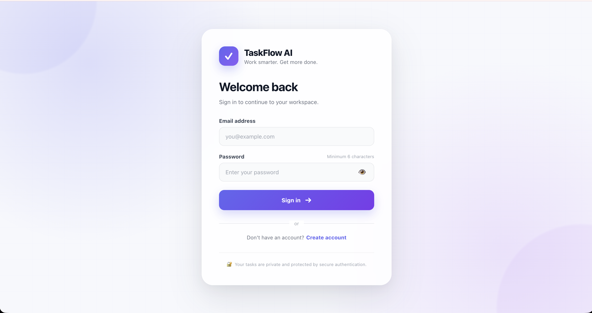
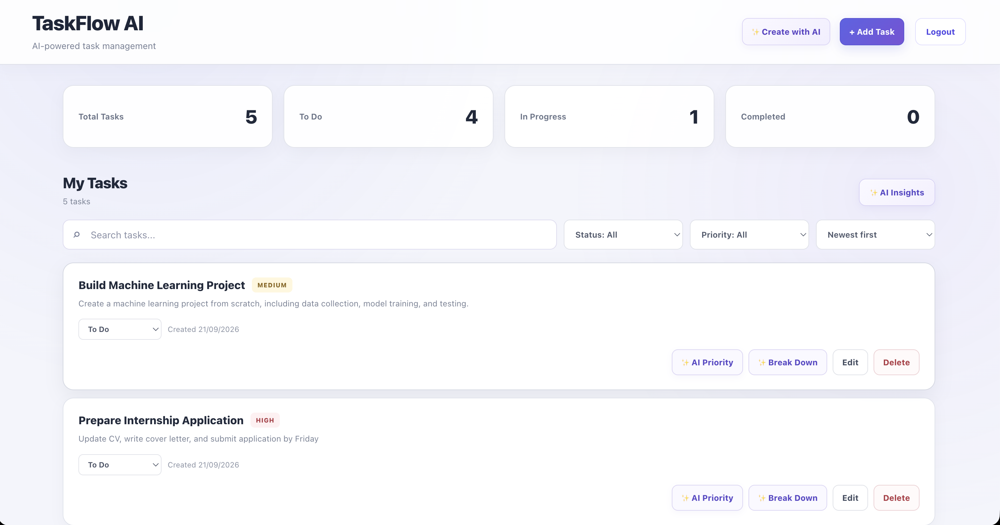
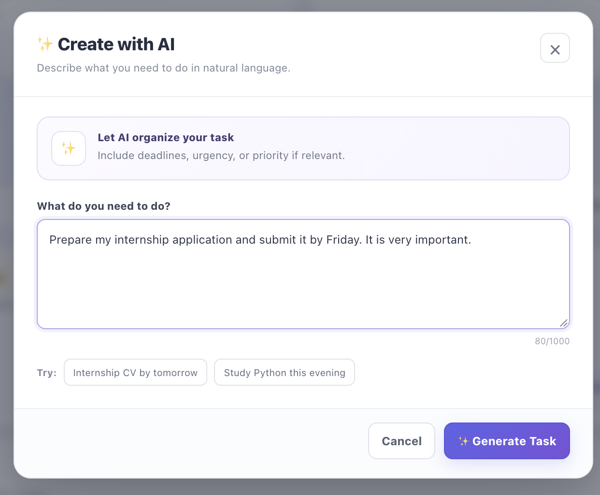
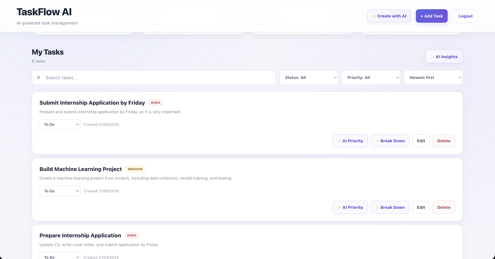
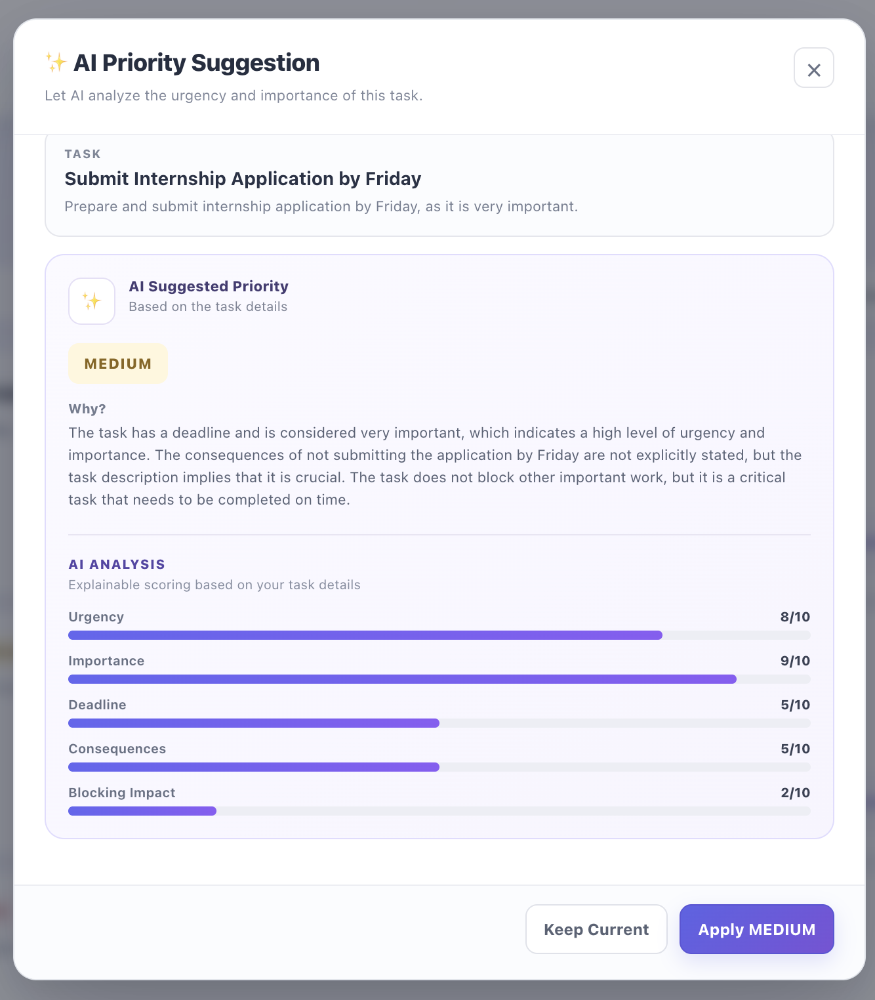

# TaskFlow AI

An AI-powered task management and productivity platform built with React, TypeScript, FastAPI, SQLAlchemy, and local Ollama AI.

TaskFlow AI combines traditional task management with AI-assisted task creation, task breakdown, priority analysis, and productivity insights.

---

## 🚀 Features

### 📋 Task Management

- Create tasks manually
- Edit existing tasks
- Delete tasks
- Track task status
- Set task priority
- Search tasks by title and description
- Filter tasks by status
- Filter tasks by priority
- Sort tasks by:
  - Newest
  - Oldest
  - Priority
  - Title

### 🤖 AI Task Creation

Describe a task naturally and let the AI convert it into a structured task.

Example:

> Finish my project report by Saturday and make it high priority.

TaskFlow AI generates:

- Task title
- Description
- Priority

AI processing runs locally using **Ollama**, so the application does not require an OpenAI API key.

### 🧩 AI Task Breakdown

Complex tasks can be broken into smaller actionable subtasks.

For example:

```text
Build a personal portfolio website

can be broken into steps such as:

1. Plan the website structure
2. Create the project
3. Build the homepage
4. Add project sections
5. Add responsive styling
6. Test the website
```

### 🎯 AI Priority Suggestions

TaskFlow AI analyzes a task using factors such as:

- Urgency
- Importance
- Deadline
- Consequences
- Blocking impact

It then calculates a priority recommendation:

- Low
- Medium
- High

The scoring calculation is performed by the backend using the AI-generated analysis.

### 📊 AI Productivity Insights

The dashboard can analyze the user's current task workload and provide:

- Completion rate
- Completed tasks
- Pending tasks
- In-progress tasks
- High-priority tasks
- Medium-priority tasks
- Low-priority tasks
- Productivity summary
- Recommended focus
- Strengths
- Practical suggestions

Numeric metrics are calculated by the backend, while Ollama is used to interpret the workload and generate useful observations.

### 🔐 Authentication

TaskFlow AI includes JWT-based authentication.

Authentication features:

- User registration
- User login
- Password hashing with bcrypt
- JWT access tokens
- Protected API endpoints
- User-specific tasks
- `/auth/me` authenticated user endpoint
- Logout
- Automatic handling of expired sessions

JWT configuration is stored in environment variables rather than being hard-coded into the application.

---

## 🏗️ Architecture

TaskFlow AI follows a client-server architecture.

```text
                    ┌─────────────────────┐
                    │    React Frontend   │
                    │  TypeScript + Vite  │
                    └──────────┬──────────┘
                               │
                               │ REST API
                               ▼
                    ┌─────────────────────┐
                    │   FastAPI Backend   │
                    │       Python        │
                    └──────────┬──────────┘
                               │
                ┌──────────────┼──────────────┐
                │              │              │
                ▼              ▼              ▼
        ┌────────────┐  ┌────────────┐  ┌────────────┐
        │ SQLAlchemy │  │ JWT Auth   │  │ AI Service │
        │  + SQLite  │  │            │  │   Ollama   │
        └────────────┘  └────────────┘  └────────────┘
```

---

## 🛠️ Tech Stack

### Frontend

- React
- TypeScript
- Vite
- CSS
- Fetch API

### Backend

- Python
- FastAPI
- SQLAlchemy
- Pydantic
- SQLite
- JWT
- Passlib
- bcrypt

### AI

- Ollama
- Llama 3.2 3B

### Development Tools

- Git
- GitHub
- VS Code
- Ruff

---

## 📁 Project Structure

```text
taskflow-ai/
│
├── backend/
│   ├── app/
│   │   ├── db/
│   │   │   └── database.py
│   │   │
│   │   ├── models/
│   │   │   ├── task.py
│   │   │   └── user.py
│   │   │
│   │   ├── schemas/
│   │   │   ├── auth.py
│   │   │   └── task.py
│   │   │
│   │   ├── services/
│   │   │   ├── ai_service.py
│   │   │   └── auth_service.py
│   │   │
│   │   ├── auth.py
│   │   └── main.py
│   │
│   ├── .env.example
│   ├── pyproject.toml
│   └── requirements.txt
│
├── frontend/
│   ├── src/
│   │   ├── assets/
│   │   ├── App.tsx
│   │   ├── App.css
│   │   ├── AuthPage.tsx
│   │   ├── AuthPage.css
│   │   ├── api.ts
│   │   ├── auth.ts
│   │   ├── index.css
│   │   └── main.tsx
│   │
│   ├── package.json
│   └── vite.config.ts
│
├── docs/
│   └── screenshots/
│       ├── 03-ai-task-creation.png
│       ├── 04-ai-generated-task.png
│       ├── 05-ai-priority.png
│       ├── dashboard.png
│       └── login-register.png
│
├── .gitignore
└── README.md
```

---

## ⚙️ Local Setup

### Prerequisites

Make sure you have installed:

- Python 3.13+
- Node.js
- npm
- Git
- Ollama

### 1. Clone the repository

```bash
git clone https://github.com/Venkateshtarapatla/taskflow-ai.git
cd taskflow-ai
```

### 2. Backend setup

Navigate to the backend:

```bash
cd backend
```

Create a virtual environment:

```bash
python3 -m venv venv
```

Activate it on macOS/Linux:

```bash
source venv/bin/activate
```

Install dependencies:

```bash
pip install -r requirements.txt
```

### 3. Configure environment variables

Create:

```text
backend/.env
```

Use `.env.example` as the template:

```env
SECRET_KEY=replace-with-a-secure-secret
JWT_ALGORITHM=HS256
ACCESS_TOKEN_EXPIRE_MINUTES=60
```

Generate a secure secret with:

```bash
openssl rand -hex 32
```

Replace:

```text
replace-with-a-secure-secret
```

with the generated value.

Never commit your `.env` file.

### 4. Install and configure Ollama

Install Ollama and make sure it is running.

Pull the model:

```bash
ollama pull llama3.2:3b
```

Verify:

```bash
ollama list
```

The application expects:

```text
llama3.2:3b
```

### 5. Start the backend

From:

```text
backend/
```

run:

```bash
uvicorn app.main:app --reload
```

The API will be available at:

```text
http://127.0.0.1:8000
```

FastAPI Swagger documentation:

```text
http://127.0.0.1:8000/docs
```

### 6. Start the frontend

Open another terminal:

```bash
cd frontend
```

Install dependencies:

```bash
npm install
```

Start the development server:

```bash
npm run dev
```

The frontend will normally be available at:

```text
http://localhost:5173
```

---

## 🧪 Code Quality

The backend uses Ruff for linting.

Run:

```bash
cd backend
source venv/bin/activate
ruff check app
```

Expected:

```text
All checks passed!
```

---

## 🔑 Environment Variables

The backend uses:

| Variable | Description |
|---|---|
| `SECRET_KEY` | Secret used for signing JWT tokens |
| `JWT_ALGORITHM` | JWT signing algorithm |
| `ACCESS_TOKEN_EXPIRE_MINUTES` | JWT expiration time |

Example:

```env
SECRET_KEY=your-secure-secret
JWT_ALGORITHM=HS256
ACCESS_TOKEN_EXPIRE_MINUTES=60
```

Real environment files are excluded from Git through `.gitignore`.

---

## 🔒 Security

TaskFlow AI includes several security practices:

- Passwords are hashed using bcrypt
- JWT tokens are used for authentication
- Protected endpoints require authentication
- JWT secrets are stored in environment variables
- Local database files are excluded from Git
- Environment files containing secrets are excluded from Git
- User tasks are associated with authenticated users
- Expired JWT sessions are handled by the frontend

---

## 🧠 AI Design

TaskFlow AI intentionally uses a local AI model rather than requiring a paid external AI API.

The current AI architecture is:

```text
User Request
     │
     ▼
FastAPI
     │
     ▼
AI Service
     │
     ▼
Ollama
     │
     ▼
Llama 3.2 3B
     │
     ▼
Structured JSON
     │
     ▼
FastAPI
     │
     ▼
React UI
```

This provides an inexpensive development environment and keeps AI inference local.

---

## 📸 Screenshots

### 🔐 Login & Registration



### 📊 Dashboard



### ✨ AI Task Creation



### 🤖 AI Generated Task



### 🎯 AI Priority Suggestion



---

## 🗺️ Roadmap

Potential future improvements include:

- PostgreSQL production database
- Production deployment
- Docker support
- Refresh-token authentication
- Password reset
- Email verification
- Task due dates
- Calendar integration
- Recurring tasks
- Advanced productivity analytics
- AI-powered task recommendations
- AI-generated weekly productivity reports
- Automated testing
- CI/CD pipeline

---

## 🎯 Project Goals

TaskFlow AI was built to explore how modern web applications can combine:

- Full-stack development
- REST APIs
- Authentication
- Database design
- AI integration
- Productivity analytics
- Responsive UI development
- Software engineering practices

The project is designed as a practical demonstration of building an AI-assisted full-stack application from the ground up.

---

## 📄 License

This project is currently intended as a personal portfolio and learning project.